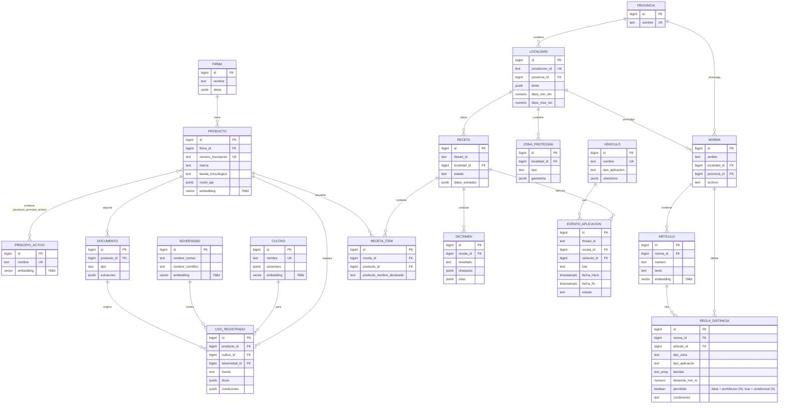

# Modelo de datos

Diagrama ER de los tres schemas (`catalogo`, `territorio`, `operacion`) y la consulta SQL que ejecuta el retriever de cada una de las 4 tools RAG. Migraciones fuente: `src/fitosanitarios/datos/migraciones/00{1,2,3}_*.sql`. Contratos de dominio: `src/fitosanitarios/dominio/modelos.py`.

Material para la defensa (ver Fase 10 de `plandefases.md`).

## Diagrama ER



Nota: `TURNO` (log por turno de conversación) no se grafica arriba por simplicidad: es una tabla de solo escritura sin relaciones FK, indexada por `thread_id`. Las tablas del checkpointer de LangGraph (Fase 7) tampoco se grafican: las crea la propia librería sobre `DATABASE_URL`.

## Consultas SQL de cada tool RAG

Las 4 queries siguen el mismo patrón: **filtro relacional primero** (jurisdicción, cultivo, tipo de zona — lo que se pueda resolver por columnas/joins), **similitud vectorial después** (`embedding <=> :query_embedding`, distancia coseno con el índice HNSW). Los parámetros con prefijo `:` se bindean desde Python; los `*_id` de cultivo/adversidad/principio activo llegan ya resueltos por un paso previo de matching (trigram + embedding), nunca se busca por texto libre directo en estas queries. Son borradores para orientar la Fase 5, no el SQL final: se ajustan ahí al implementar los retrievers de verdad contra datos reales.

### `validar_producto_registro`

Candidatos por nombre (trigram + embedding), con sus principios activos y usos registrados.

```sql
SELECT
    p.id,
    p.numero_inscripcion,
    p.marca,
    p.banda_toxicologica,
    p.estado_producto,
    similarity(p.marca, :nombre_declarado) AS score_trgm,
    1 - (p.embedding <=> :embedding_nombre) AS score_embedding,
    jsonb_agg(DISTINCT jsonb_build_object(
        'principio_activo', pa.nombre,
        'concentracion', ppa.concentracion,
        'unidad', ppa.unidad
    )) AS principios_activos,
    jsonb_agg(DISTINCT jsonb_build_object(
        'cultivo', c.nombre,
        'adversidad', a.nombre_comun,
        'dosis', ur.dosis,
        'condiciones', ur.condiciones,
        'fuente', ur.fuente
    )) FILTER (WHERE ur.id IS NOT NULL) AS usos_registrados
FROM catalogo.producto p
JOIN catalogo.producto_principio_activo ppa ON ppa.producto_id = p.id
JOIN catalogo.principio_activo pa ON pa.id = ppa.principio_activo_id
LEFT JOIN catalogo.uso_registrado ur ON ur.producto_id = p.id
LEFT JOIN catalogo.cultivo c ON c.id = ur.cultivo_id
LEFT JOIN catalogo.adversidad a ON a.id = ur.adversidad_id
WHERE p.marca % :nombre_declarado  -- pg_trgm: por encima del umbral de similarity()
GROUP BY p.id
ORDER BY (0.5 * similarity(p.marca, :nombre_declarado)
          + 0.5 * (1 - (p.embedding <=> :embedding_nombre))) DESC
LIMIT 5;
```

Sin candidatos por encima del umbral combinado → `PRODUCTO_NO_ENCONTRADO`. `usos_registrados` vacío para todos los candidatos elegidos → `SIN_USOS_REGISTRADOS`.

### `evaluar_riesgo`

Tres consultas encadenadas (localidad → zonas en radio → reglas candidatas); la geometría exacta (punto en polígono, distancia) se resuelve en Python sobre el resultado.

```sql
-- 1) Localidad(es) candidata(s) por bbox (prefiltro; el punto-en-polígono exacto es en Python)
SELECT id, jurisdiccion_id, nombre, provincia_id, limite
FROM territorio.localidad
WHERE :lon BETWEEN bbox_min_lon AND bbox_max_lon
  AND :lat BETWEEN bbox_min_lat AND bbox_max_lat;

-- 2) Zonas protegidas dentro del radio de búsqueda, también de localidades vecinas
--    (prefiltro por bbox expandido en grados; la distancia exacta se recalcula en
--    Python reproyectando a estimate_utm_crs(), ver servicios/geo.py)
SELECT zp.id, zp.tipo, zp.nombre, zp.geometria, l.jurisdiccion_id
FROM territorio.zona_protegida zp
JOIN territorio.localidad l ON l.id = zp.localidad_id
WHERE zp.bbox_min_lon <= :lon + :radio_grados AND zp.bbox_max_lon >= :lon - :radio_grados
  AND zp.bbox_min_lat <= :lat + :radio_grados AND zp.bbox_max_lat >= :lat - :radio_grados;

-- 3) Reglas candidatas: de la localidad del lote, su provincia y las nacionales
-- (:permitido = false para el dictamen y el agendado; true trae las condicionales, para consultas)
SELECT rd.tipo_zona, rd.tipo_aplicacion, rd.bandas, rd.distancia_min_m, rd.observaciones,
       rd.permitido, rd.condiciones, n.ambito, n.archivo AS norma, a.numero AS articulo
FROM territorio.regla_distancia rd
JOIN territorio.norma n ON n.id = rd.norma_id
LEFT JOIN territorio.articulo a ON a.id = rd.articulo_id
WHERE rd.permitido = :permitido
  AND ((n.ambito = 'municipal' AND n.localidad_id = :localidad_id)
    OR (n.ambito = 'provincial' AND n.provincia_id = :provincia_id)
    OR (n.ambito = 'nacional'));
```

`:radio_grados` es una conversión aproximada de `RADIO_BUSQUEDA_ZONAS_M` a grados (varía con la latitud); solo sirve de prefiltro amplio, nunca para decidir la distancia final. Sin resultados en la consulta 1 → `JURISDICCION_NO_CUBIERTA`. Consulta 3 vacía para el tipo de zona/aplicación del caso → `SIN_REGLA_APLICABLE`.

### `responder_consulta_normativa`

Filtro relacional por jurisdicción (join `articulo → norma`) y luego similitud vectorial.

```sql
SELECT
    a.id,
    a.numero AS articulo,
    a.texto,
    a.pagina,
    n.archivo AS norma,
    n.ambito,
    COALESCE(l.jurisdiccion_id, pr.nombre, 'nacional') AS jurisdiccion_id,
    1 - (a.embedding <=> :embedding_pregunta) AS score
FROM territorio.articulo a
JOIN territorio.norma n ON n.id = a.norma_id
LEFT JOIN territorio.localidad l ON l.id = n.localidad_id
LEFT JOIN territorio.provincia pr ON pr.id = n.provincia_id
WHERE (n.ambito = 'municipal' AND n.localidad_id = :localidad_id)
   OR (n.ambito = 'provincial' AND n.provincia_id = :provincia_id)
   OR (n.ambito = 'nacional')
ORDER BY a.embedding <=> :embedding_pregunta
LIMIT 8;
```

En código: se descartan los resultados con `score < RAG_UMBRAL_SIMILITUD`; si no queda ninguno → `NORMATIVA_SIN_RESPALDO`. El LLM solo puede citar artículos presentes en este resultado (verificación de citas en código, ver skill sección "RAG de normativa").

### `consultar_productos`

Listado filtrado por cultivo/adversidad/principio activo/banda; los `*_id` ya vienen resueltos por embedding+trigram contra `catalogo.cultivo`/`adversidad`/`principio_activo` en un paso previo.

```sql
SELECT DISTINCT
    p.id,
    p.numero_inscripcion,
    p.marca,
    p.banda_toxicologica,
    ur.dosis,
    c.nombre AS cultivo,
    a.nombre_comun AS adversidad
FROM catalogo.uso_registrado ur
JOIN catalogo.producto p ON p.id = ur.producto_id
JOIN catalogo.cultivo c ON c.id = ur.cultivo_id
LEFT JOIN catalogo.adversidad a ON a.id = ur.adversidad_id
LEFT JOIN catalogo.producto_principio_activo ppa ON ppa.producto_id = p.id
LEFT JOIN catalogo.principio_activo pa ON pa.id = ppa.principio_activo_id
WHERE (:cultivo_id IS NULL OR c.id = :cultivo_id)
  AND (:adversidad_id IS NULL OR a.id = :adversidad_id)
  AND (:principio_activo_id IS NULL OR pa.id = :principio_activo_id)
  AND (:bandas_hasta_banda_maxima IS NULL OR p.banda_toxicologica = ANY(:bandas_hasta_banda_maxima))
ORDER BY p.marca
LIMIT :limite OFFSET :offset;
```

Al menos uno de `cultivo_id` / `adversidad_id` / `principio_activo_id` es requerido (ver `docs/matriz-parametros.md`); si los tres son `NULL` la tool no ejecuta esta consulta y repregunta antes.

## Por qué no es una tabla plana

Criterio transversal de aceptación de la cátedra (ver `plandefases.md`, sección "Reglas para escribir el plan"): no existe ninguna tabla genérica `documento + embedding + metadata`. Cada entidad que se busca por significado (`producto`, `principio_activo`, `cultivo`, `adversidad`, `articulo`) tiene su propia tabla relacional con su propia columna `vector`, sus propias FK y sus propias columnas para filtrar (banda, tipo de zona, ámbito, etc.). `tests/datos/test_sin_tabla_plana.py` (Fase 5) verifica esto por consulta a `information_schema`.
