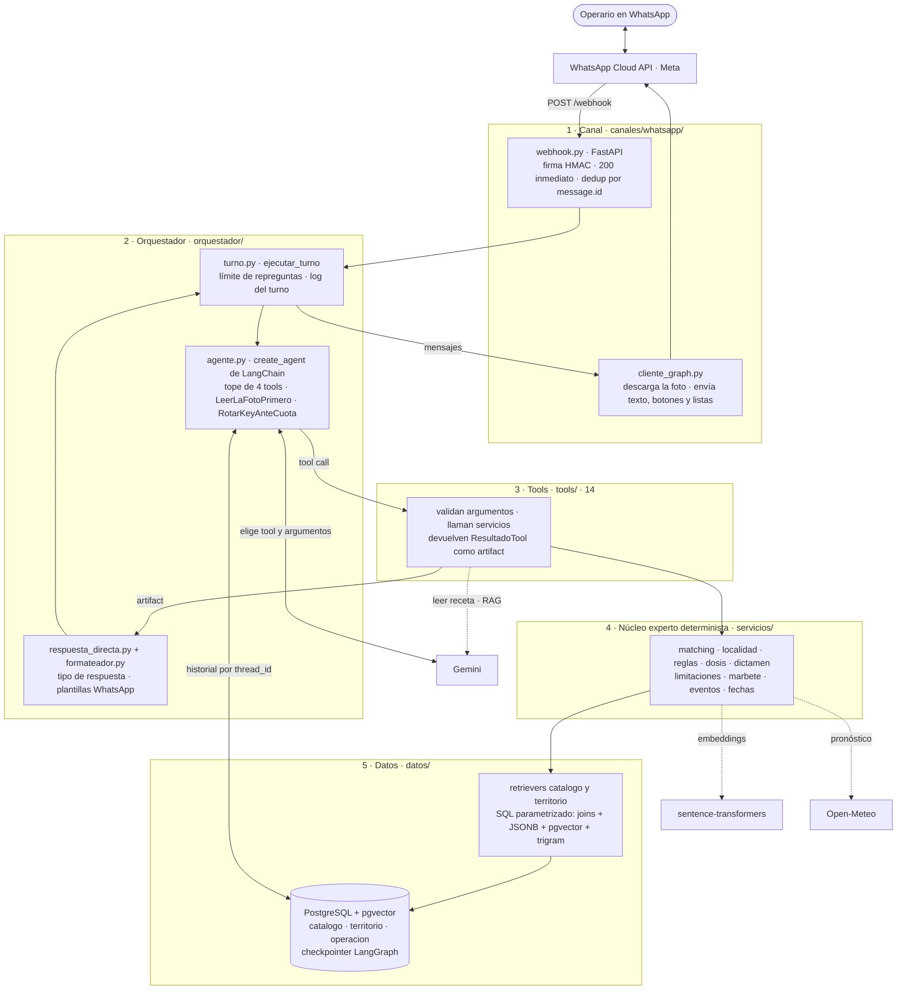
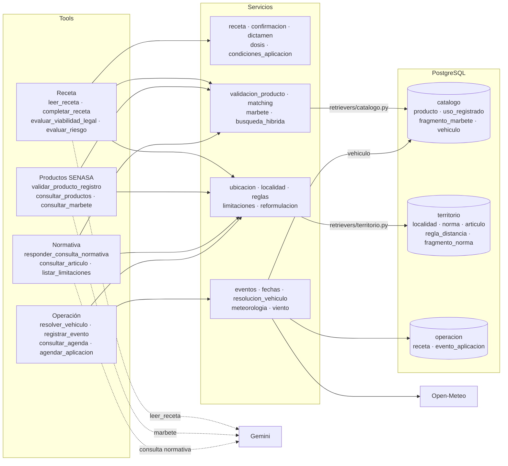
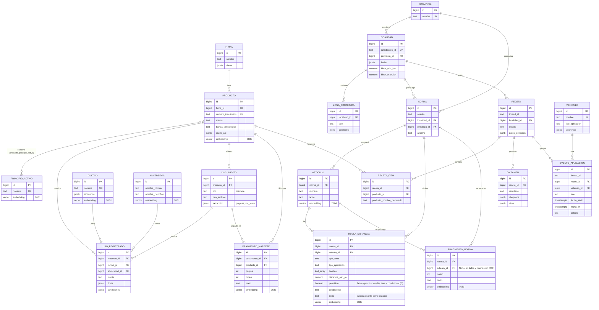

# Modelo de datos

Arquitectura del sistema experto (canal, orquestador, tools, servicios y base), diagrama ER de los tres schemas (`catalogo`, `territorio`, `operacion`) y la consulta SQL que ejecuta el retriever de cada una de las 5 tools RAG. Migraciones fuente: `src/fitosanitarios/datos/migraciones/00{1..7}_*.sql` (la 006 y la 007 agregan los índices de fragmentos de normas y de marbetes). Contratos de dominio: `src/fitosanitarios/dominio/modelos.py`.

Material para la defensa (ver Fase 10 de `plandefases.md`).

## Arquitectura del sistema experto

El LLM orquesta y el núcleo decide: Gemini interpreta el mensaje y elige la tool con sus argumentos; las tools llaman a servicios deterministas que consultan la base con SQL parametrizado, y la respuesta se arma en código a partir de lo que devolvieron las tools (el LLM no escribe números, normas ni dosis).

### Capas y recorrido de un mensaje



**Un turno, de punta a punta:**

1. Meta hace `POST /webhook`. El webhook valida la firma, responde 200 enseguida, descarta los duplicados por `message.id` y procesa en segundo plano. Si el mensaje trae una foto, la descarga por la Graph API.
2. `ejecutar_turno` invoca al agente con `thread_id` igual al número del operario. El checkpointer de LangGraph recupera la conversación.
3. Gemini elige la tool y arma los argumentos. Con foto, `LeerLaFotoPrimero` fuerza a que la primera llamada sea `leer_receta`. Hay un tope de 4 llamadas a tools por turno, y si una key se queda sin cuota se pasa a la siguiente.
4. La tool valida los argumentos y llama a los servicios. Los servicios resuelven con código determinista: matching de productos, localidad, reglas, dosis y dictamen. Consultan la base por los retrievers, con SQL parametrizado que combina joins, filtros sobre columnas y JSONB, y distancia vectorial.
5. La tool devuelve un `ResultadoTool` como artifact. 12 de las 14 tools cierran el turno ahí (`return_direct`), y el tipo de respuesta sale de la tabla de `respuesta_directa.py`. Con `evaluar_riesgo` y `resolver_vehiculo`, el modelo elige el tipo.
6. El formateador arma los mensajes de WhatsApp a partir de los artifacts, no del texto del LLM. `cliente_graph.py` los envía, y el turno queda registrado en `operacion.turno`.

### Qué usa cada tool

Los servicios de receta y dictamen son funciones puras sobre lo que ya trajeron los demás: no consultan la base.




| Tool | Servicios | Tablas | Externo |
|---|---|---|---|
| `leer_receta` | receta | — | Gemini multimodal |
| `completar_receta` | receta | — (la receta sale del artifact anterior) | — |
| `evaluar_viabilidad_legal` | receta, confirmacion, validacion_producto, condiciones_aplicacion, dictamen, ubicacion | `catalogo.producto`, `uso_registrado`; `territorio.localidad`, `regla_distancia` | — |
| `evaluar_riesgo` | validacion_producto, condiciones_aplicacion, dictamen, ubicacion | ídem | — |
| `validar_producto_registro` | validacion_producto, marbete, condiciones_aplicacion | `catalogo.producto`, `uso_registrado`, `fragmento_marbete` | Gemini, si busca la dosis en el marbete |
| `consultar_productos` | limitaciones, reglas, ubicacion | `catalogo.*` (producto, cultivo, adversidad, principio_activo, firma); `territorio.regla_distancia` | — |
| `consultar_marbete` | matching, marbete, busqueda_hibrida, reformulacion | `catalogo.producto`, `fragmento_marbete` | Gemini |
| `responder_consulta_normativa` | ubicacion, reformulacion | `territorio.fragmento_norma`, `regla_distancia` | Gemini |
| `consultar_articulo` | ubicacion, localidad | `territorio.norma`, `articulo` | — |
| `listar_limitaciones` | limitaciones, reglas, condiciones_aplicacion, matching, ubicacion | `territorio.regla_distancia`; `catalogo.producto` (banda) | — |
| `resolver_vehiculo` | resolucion_vehiculo | `catalogo.vehiculo` | — |
| `registrar_evento` | eventos, resolucion_vehiculo, fechas | `operacion.evento_aplicacion`, `receta`; `catalogo.vehiculo` | — |
| `consultar_agenda` | eventos, fechas | `operacion.receta`, `evento_aplicacion` | — |
| `agendar_aplicacion` | eventos, fechas, localidad, reglas, meteorologia, viento | `operacion.receta`; `territorio.regla_viento` | Open-Meteo |

Todas usan `servicios/recursos.py`, que da la conexión y el modelo de embeddings, y `servicios/formato.py`. La carga es offline y no pasa por el agente: el vademécum de SENASA se scrapea una vez a un snapshot y se carga a `catalogo`, y los insumos de cada localidad (GeoJSON, normas y `reglas.csv`) se validan y se cargan a `territorio`.

## Diagrama ER



Nota: `TURNO` (log por turno de conversación) no se grafica arriba por simplicidad: es una tabla de solo escritura sin relaciones FK, indexada por `thread_id`. Las tablas del checkpointer de LangGraph (Fase 7) tampoco se grafican: las crea la propia librería sobre `DATABASE_URL`.

## Consultas SQL de cada tool RAG

Las 5 queries siguen el mismo patrón: **filtro relacional primero** (jurisdicción, cultivo, tipo de zona — lo que se pueda resolver por columnas/joins), **similitud vectorial después** (`embedding <=> :query_embedding`, distancia coseno con el índice HNSW). Los parámetros con prefijo `:` se bindean desde Python; los `*_id` de cultivo/adversidad/principio activo llegan ya resueltos por un paso previo de matching (trigram + embedding), nunca se busca por texto libre directo en estas queries. Las de `validar_producto_registro` y `evaluar_riesgo` son borradores de la Fase 1 para orientar los retrievers; las de `responder_consulta_normativa`, `consultar_marbete` y `consultar_productos` son las que se ejecutan hoy (copiadas de `datos/retrievers/territorio.py` y `datos/retrievers/catalogo.py`). `consultar_productos` filtra también por JSONB (la aptitud) y por texto (firma y marca), no solo por los `*_id`.

### `validar_producto_registro`

Candidatos por nombre (trigram + embedding), con sus principios activos y usos registrados.

```sql
SELECT
    p.id,
    p.numero_inscripcion,
    p.marca,
    p.banda_toxicologica,
    p.estado_producto,
    similarity(p.marca, :nombre_declarado) AS score_trgm,
    1 - (p.embedding <=> :embedding_nombre) AS score_embedding,
    jsonb_agg(DISTINCT jsonb_build_object(
        'principio_activo', pa.nombre,
        'concentracion', ppa.concentracion,
        'unidad', ppa.unidad
    )) AS principios_activos,
    jsonb_agg(DISTINCT jsonb_build_object(
        'cultivo', c.nombre,
        'adversidad', a.nombre_comun,
        'dosis', ur.dosis,
        'condiciones', ur.condiciones,
        'fuente', ur.fuente
    )) FILTER (WHERE ur.id IS NOT NULL) AS usos_registrados
FROM catalogo.producto p
JOIN catalogo.producto_principio_activo ppa ON ppa.producto_id = p.id
JOIN catalogo.principio_activo pa ON pa.id = ppa.principio_activo_id
LEFT JOIN catalogo.uso_registrado ur ON ur.producto_id = p.id
LEFT JOIN catalogo.cultivo c ON c.id = ur.cultivo_id
LEFT JOIN catalogo.adversidad a ON a.id = ur.adversidad_id
WHERE p.marca % :nombre_declarado  -- pg_trgm: por encima del umbral de similarity()
GROUP BY p.id
ORDER BY (0.5 * similarity(p.marca, :nombre_declarado)
          + 0.5 * (1 - (p.embedding <=> :embedding_nombre))) DESC
LIMIT 5;
```

Sin candidatos por encima del umbral combinado → `PRODUCTO_NO_ENCONTRADO`. `usos_registrados` vacío para todos los candidatos elegidos → `SIN_USOS_REGISTRADOS`.

### `evaluar_riesgo`

La localidad se resuelve por nombre (`servicios/localidad.py::resolver_localidad`, sobre `listar_localidades` y `listar_municipios`); desde el 19/09/2026 no se usa la ubicación del lote. Con la localidad, una sola consulta trae las reglas candidatas, y en Python se filtran por tipo de zona, aplicación y banda y gana la más restrictiva.

```sql
-- Reglas candidatas: de la localidad del lote, su provincia y las nacionales
-- (:permitido = false para el dictamen y el agendado; true trae las condicionales, para consultas)
SELECT rd.tipo_zona, rd.tipo_aplicacion, rd.bandas, rd.distancia_min_m, rd.observaciones,
       rd.permitido, rd.condiciones, n.ambito, n.archivo AS norma, a.numero AS articulo
FROM territorio.regla_distancia rd
JOIN territorio.norma n ON n.id = rd.norma_id
LEFT JOIN territorio.articulo a ON a.id = rd.articulo_id
WHERE rd.permitido = :permitido
  AND ((n.ambito = 'municipal' AND n.localidad_id = :localidad_id)
    OR (n.ambito = 'provincial' AND n.provincia_id = :provincia_id)
    OR (n.ambito = 'nacional'));
```

Localidad desconocida (ni cargada ni municipio de una provincia con normativa) → `JURISDICCION_NO_CUBIERTA`. Consulta vacía para el tipo de zona/aplicación del caso → `SIN_REGLA_APLICABLE`.

### `responder_consulta_normativa`

Busca en dos índices a la vez: los fragmentos de las normas (artículos partidos con el `RecursiveCharacterTextSplitter` de la cursada, 800 caracteres con 120 de solapamiento, más los fallos y las normas sin PDF) y las reglas de `reglas.csv` escritas como oración. Filtro relacional por jurisdicción primero (la localidad, su provincia y la nación) y similitud después.

```sql
SELECT * FROM (
    SELECT 'fragmento' AS tipo, f.id, a.numero, f.texto, n.archivo, n.ambito,
           COALESCE(l.jurisdiccion_id, pr.nombre, 'nacional') AS jurisdiccion_id,
           1 - (f.embedding <=> :embedding_consulta) AS score
    FROM territorio.fragmento_norma f
    JOIN territorio.norma n ON n.id = f.norma_id
    LEFT JOIN territorio.articulo a ON a.id = f.articulo_id
    LEFT JOIN territorio.localidad l ON l.id = n.localidad_id
    LEFT JOIN territorio.provincia pr ON pr.id = n.provincia_id
    WHERE (n.ambito = 'municipal' AND n.localidad_id = :localidad_id)
       OR (n.ambito = 'provincial' AND n.provincia_id = :provincia_id)
       OR (n.ambito = 'nacional')
    UNION ALL
    SELECT 'regla', r.id, a.numero, r.texto, n.archivo, n.ambito,
           COALESCE(l.jurisdiccion_id, pr.nombre, 'nacional'),
           1 - (r.embedding <=> :embedding_consulta)
    FROM territorio.regla_distancia r
    JOIN territorio.norma n ON n.id = r.norma_id
    LEFT JOIN territorio.articulo a ON a.id = r.articulo_id
    LEFT JOIN territorio.localidad l ON l.id = n.localidad_id
    LEFT JOIN territorio.provincia pr ON pr.id = n.provincia_id
    WHERE r.embedding IS NOT NULL
      AND ((n.ambito = 'municipal' AND n.localidad_id = :localidad_id)
        OR (n.ambito = 'provincial' AND n.provincia_id = :provincia_id)
        OR (n.ambito = 'nacional'))
) contexto
ORDER BY score DESC
LIMIT 8;
```

`:embedding_consulta` no es el de la pregunta tal cual: antes de buscar, el LLM reformula la pregunta con los términos que usaría la norma ("¿a cuánto del pueblo?" → "planta urbana, ejido, distancia mínima") y se busca con la pregunta más esa línea (`servicios/reformulacion.py`). Si el LLM dice que la pregunta no es del tema (`FUERA`), no se busca.

En código: se descartan los resultados con `score < RAG_UMBRAL_SIMILITUD`; si no queda ninguno → `NORMATIVA_SIN_RESPALDO`. El LLM responde solo con esos fragmentos, y cada artículo que cita se verifica contra lo recuperado: si no está, se descarta la cita; sin ninguna cita verificada tampoco hay respuesta.

### `consultar_marbete`

RAG sobre el marbete de SENASA de un producto (carencia, precauciones, mezclas, reingreso, derrames). El producto se resuelve antes con el matching de `validar_producto_registro`; la consulta trae **todos** los fragmentos del marbete de ese producto (unos 25), con su similitud y sus palabras llevadas a la raíz, para rankearlos en Python.

```sql
SELECT f.id, f.pagina, f.texto,
       1 - (f.embedding <=> :embedding_consulta) AS score,
       ARRAY(
           SELECT u.lexeme
           FROM unnest(to_tsvector('spanish', f.texto)) u,
                generate_series(1, COALESCE(array_length(u.positions, 1), 1))
       ) AS palabras  -- cada palabra en su raíz, una vez por aparición (para BM25)
FROM catalogo.fragmento_marbete f
WHERE f.producto_id = :producto_id
ORDER BY f.pagina, f.orden;
```

Se ordena por página y no por `embedding <=> ...` a propósito: así Postgres filtra por producto con el índice común y calcula la similitud exacta de esos 25 fragmentos, en vez de usar el índice HNSW sobre los 76.000 fragmentos de toda la tabla y filtrar después (que puede devolver menos filas, o ninguna).

Búsqueda híbrida en Python (`servicios/busqueda_hibrida.py`): los fragmentos se rankean por similitud y por palabras (BM25 sobre esos 25 fragmentos, así "reingresar", que aparece en una página, pesa mucho más que "lote", que aparece en todas), y los dos rankings se fusionan con Reciprocal Rank Fusion (k = 60). Entran al contexto los 5 primeros que pasan `RAG_UMBRAL_SIMILITUD`, o que entran por palabras con BM25 ≥ 2 y una similitud mínima de 0,30. Como en normativa, la consulta es la pregunta más la línea que escribe el LLM con los términos del marbete.

Sin ningún fragmento, o sin ninguna página citada que esté entre lo recuperado → `MARBETE_SIN_RESPALDO`. Las citas se muestran como "SENASA, Reg. 30596 (marbete, pág. 8)".

### `consultar_productos`

Una fila por producto que cumple todos los filtros dados, en cualquier combinación (`datos/retrievers/catalogo.py::listar_productos_por_filtro`). Cultivo, adversidad y principio activo llegan resueltos por embedding + trigram contra su tabla; la aptitud se filtra sobre el JSONB del registro; la firma, por trigram de palabras (`resolver_firmas`); la marca, por texto contenido. Las bandas salen de lo que dijo el operario o, con una localidad y una distancia, de las reglas de distancia a la zona urbana.

```sql
WITH usos AS (
    SELECT ur.producto_id,
           array_remove(array_agg(DISTINCT NULLIF(ur.dosis->>'texto_original', '')), NULL) AS dosis,
           count(DISTINCT ur.adversidad_id) AS adversidades
    FROM catalogo.uso_registrado ur
    WHERE :con_usos                       -- solo si se filtró por cultivo o adversidad
      AND (:cultivo_id IS NULL OR ur.cultivo_id = :cultivo_id)
      AND (:adversidad_id IS NULL OR ur.adversidad_id = :adversidad_id)
    GROUP BY ur.producto_id
)
SELECT p.id, p.numero_inscripcion, p.marca, p.banda_toxicologica,
       f.nombre AS firma, u.dosis, u.adversidades,
       count(*) OVER () AS total          -- el total real, no el LIMIT
FROM catalogo.producto p
LEFT JOIN catalogo.firma f ON f.id = p.firma_id
LEFT JOIN usos u ON u.producto_id = p.id
WHERE (NOT :con_usos OR u.producto_id IS NOT NULL)
  AND (:principio_id IS NULL OR EXISTS (
        SELECT 1 FROM catalogo.producto_principio_activo ppa
        WHERE ppa.producto_id = p.id AND ppa.principio_activo_id = :principio_id))
  AND (:aptitudes IS NULL OR EXISTS (
        SELECT 1 FROM jsonb_array_elements(p.crudo_api->'productos_aptitudes') apt
        WHERE apt->'nomenclador'->>'descripcion' = ANY(:aptitudes)))
  AND (:firma_ids IS NULL OR p.firma_id = ANY(:firma_ids))
  AND (:marca IS NULL OR p.marca ILIKE '%' || :marca || '%')
  AND (:bandas IS NULL OR p.banda_toxicologica = ANY(:bandas))
ORDER BY p.marca, p.numero_inscripcion
LIMIT :limite OFFSET :offset;
```

Hace falta al menos un filtro (ver `docs/matriz-parametros.md`). Hasta el 28/09/2026 era una fila por uso registrado (el mismo producto salía una vez por maleza), el total era el `LIMIT` y la aptitud se aceptaba pero no se filtraba.

## Por qué no es una tabla plana

Criterio transversal de aceptación de la cátedra (ver `plandefases.md`, sección "Reglas para escribir el plan"): no existe ninguna tabla genérica `documento + embedding + metadata`. Cada entidad que se busca por significado (`producto`, `principio_activo`, `cultivo`, `adversidad`, `articulo`, `regla_distancia`) tiene su propia tabla relacional con su propia columna `vector`, sus propias FK y sus propias columnas para filtrar (banda, tipo de zona, ámbito, etc.). `tests/datos/test_sin_tabla_plana.py` (Fase 5) verifica esto por consulta a `information_schema`.

Los fragmentos de los RAG tampoco son una tabla genérica: `catalogo.fragmento_marbete` cuelga de su documento y de su producto (se busca siempre dentro del marbete de un producto) y `territorio.fragmento_norma` de su norma y, cuando lo hay, de su artículo (se filtra por jurisdicción y se cita el artículo). Son dos tablas distintas, en su schema, con sus FK.
