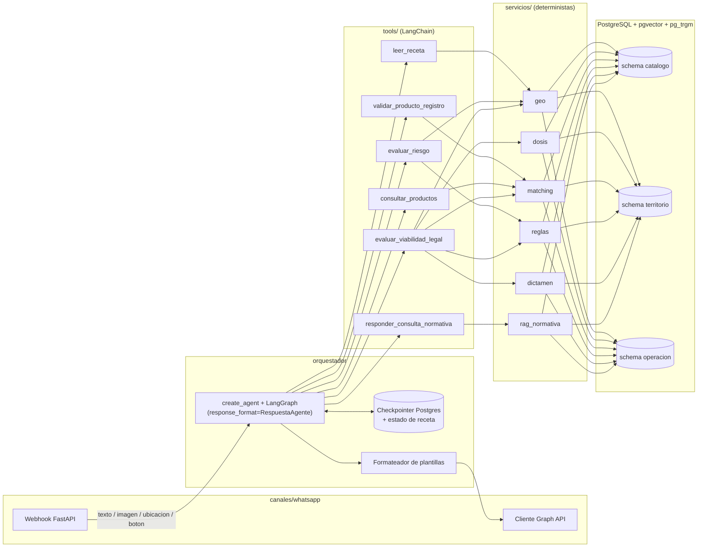

# Plan de fases — Agente de recetas fitosanitarios (TP2 IA)

POC de un agente conversacional por WhatsApp que lee recetas agronómicas de fitosanitarios, las contrasta con el registro de SENASA y la normativa de 10 localidades, y dictamina si la aplicación es viable/legal. Fuente de verdad de arquitectura, contratos y reglas: skill `agente-fitosanitarios` (`.claude/skills/agente-fitosanitarios/SKILL.md`). Entrega: 30/09/2026.

## Diagrama de arquitectura



## Diagrama de dependencias entre fases

```mermaid
graph TD
    F0[Fase 0 · Setup] --> F1[Fase 1 · Dominio y contratos]
    F1 --> F2[Fase 2 · Scraper SENASA]
    F1 --> F3[Fase 3 · Ingesta SIG y normativa]
    F1 -.stub.-> F4[Fase 4 · leer_receta]
    F1 -.stub.-> F5[Fase 5 · Tools de validación y dictamen]
    F1 -.stub.-> F6[Fase 6 · responder_consulta_normativa]
    F2 -->|datos reales| F5
    F3 -->|datos reales| F5
    F3 -->|datos reales| F6
    F4 --> F7[Fase 7 · Orquestador]
    F5 --> F7
    F6 --> F7
    F7 --> F8[Fase 8 · Canal WhatsApp]
    F8 --> F9[Fase 9 · Extensiones (opcional)]
    F8 --> F10[Fase 10 · Demo y documentación]
    F9 -.-> F10
```

## Resumen de fases

| Fase | Nombre | Núcleo / Extensión | Estimación (h) |
|---|---|---|---|
| 0 | Setup | Núcleo | 8–14 |
| 1 | Dominio y contratos | Núcleo | 16–24 |
| 2 | Scraper SENASA y base de productos | Núcleo | 20–30 |
| 3 | Ingesta SIG y normativa | Núcleo | 16–24 |
| 4 | `leer_receta` | Núcleo | 14–20 |
| 5 | Tools de validación y dictamen | Núcleo | 24–32 |
| 6 | `responder_consulta_normativa` | Núcleo | 10–16 |
| 7 | Orquestador | Núcleo | 24–32 |
| 8 | Canal WhatsApp | Núcleo | 14–20 |
| 9 | Extensiones (RF6–RF9) | Extensión, recortable | 20–30 |
| 10 | Demo, documentación y defensa | Núcleo | 10–16 |
| | **Total núcleo (0–8, 10)** | | **156–228** |
| | **Total con extensiones** | | **176–258** |

Las horas asumen una persona trabajando sola; con más manos las fases 2/3, 4/6 y partes de la 9 pueden correr en paralelo (ver dependencias).

## Mapeo RF → fases (derivado, no verificado contra la propuesta original)

`docs/propuesta-tp2-fitosanitarios.md` no está disponible en este repositorio (ver "Decisiones abiertas" #1). Los RF1–RF11 se infieren de las referencias explícitas del prompt y la skill: sección 1 dice que el núcleo cubre "RF1–RF5, RF10, RF11" y la fase 9 dice que las extensiones son "RF6–RF9: `resolver_vehiculo`, `registrar_evento`, `consultar_agenda`, identificación por número". De ahí:

| RF | Funcionalidad | Fase principal |
|---|---|---|
| RF1 | Lectura multimodal de receta | Fase 4 |
| RF2 | Confirmación/corrección de datos extraídos | Fase 4, Fase 7 |
| RF3 | Validación de producto contra registro SENASA | Fase 5 |
| RF4 | Evaluación de riesgo geográfico (distancias, jurisdicción) | Fase 5 |
| RF5 | Dictamen de viabilidad legal | Fase 5 |
| RF6 | `resolver_vehiculo` (extensión) | Fase 9 |
| RF7 | `registrar_evento` (extensión) | Fase 9 |
| RF8 | `consultar_agenda` (extensión) | Fase 9 |
| RF9 | Identificación por número de teléfono (extensión) | Fase 9 |
| RF10 | Consulta normativa (`responder_consulta_normativa`) | Fase 6 |
| RF11 | Consulta de productos registrados (`consultar_productos`) | Fase 5 |

**(verificar)** esta numeración exacta contra `docs/propuesta-tp2-fitosanitarios.md` en cuanto esté disponible; si difiere, actualizar esta tabla y anotarlo en `DECISIONES.md`.

## Decisiones abiertas

1. **Propuesta original no disponible.** El prompt pide leer `docs/propuesta-tp2-fitosanitarios.md` (tools, RAGs, RF1–RF11 y stack) antes de planificar; ese archivo no existe en este repo. Se usó la skill `agente-fitosanitarios` como única fuente de verdad, tal como indica su propia regla de precedencia. Falta: copiar la propuesta real a `docs/propuesta-tp2-fitosanitarios.md` y contrastar el mapeo RF de la tabla anterior antes de cerrar la Fase 1.
2. **Presupuesto de tiempo ajustado.** De hoy (11/09/2026) a la entrega (30/09/2026) hay 19 días corridos. El total estimado de núcleo (156–228 h) implica entre 8 y 12 h/día si trabaja una sola persona sin extensiones, lo cual es exigente. Se necesita definir con el usuario: dedicación real disponible por día, si hay más de una persona, y si se acepta arrancar a recortar alcance (ver "Qué recortar" al final) antes de llegar a fases avanzadas, no después.
3. ~~**Modelo de embeddings.**~~ **Cerrada en la Fase 1.** `sentence-transformers/paraphrase-multilingual-mpnet-base-v2` (768 dim), confirmado con benchmark real (200 nombres sintéticos, 11,0 ms/nombre en CPU) — ver `DECISIONES.md`. Dimensión 768 ya fijada en las migraciones SQL.
4. **Gestor de dependencias.** El plan asume `uv` por velocidad de instalación en CI, pero no fue verificado contra lo que exige la cátedra o el entorno del usuario. `poetry` es la alternativa directa si `uv` no es viable. **(verificar)** antes de la Fase 0.
5. **`create_agent` / API v1 de LangChain.** Las tareas asumen `langchain.agents.create_agent` con middleware y `response_format` sobre LangGraph, según la nota de relevamiento (LangChain v1 reemplaza `create_react_agent`/`AgentExecutor`). Nombres exactos de parámetros, forma de declarar `response_format` y compatibilidad de `content_and_artifact` en tools **(verificar)** contra la documentación vigente al iniciar la Fase 7 — la API puede cambiar entre el 11/09 y la fecha real de implementación.
6. **Cuotas de Gemini/Groq.** No se verificaron límites de tokens/minuto ni modelos vigentes; el plan solo fija el mecanismo de rotación y fallback. **(verificar)** en la consola de cada proveedor al iniciar la Fase 0.
7. **Cobertura mínima de localidades para arrancar Fase 3.** Se asume el mínimo indicado fuera del plan (2 localidades completas + leyes provinciales) tal como lo fija el documento fuente; las 10 tienen que estar cargadas antes de cerrar la Fase 5. Confirmar con el equipo que provee los insumos que ese cronograma es alcanzable dado el punto 2.

---

## Fase 0 — Setup

**Objetivo:** dejar el repo, el entorno y la infraestructura mínima listos para desarrollar sin bloqueos (Postgres con extensiones, configuración, cliente LLM intercambiable, CI). **RF que cubre:** ninguno directo; habilita todas las fases.

**Depende de:** insumos: ninguno. **Qué habilita:** todas las fases siguientes.

**Entregables:**
- `pyproject.toml` (o `requirements.txt` + `requirements-dev.txt`, según gestor elegido — decisión abierta #4), Python 3.12.
- `src/fitosanitarios/config.py` (lectura de `.env` con pydantic-settings, **verificar** paquete vigente).
- `.env.example` con todas las variables listadas en la skill, sin valores reales.
- `docker-compose.yml`: Postgres 16 con `pgvector` y `pg_trgm`.
- `src/fitosanitarios/llm/client.py` (cliente real con rotación de `GEMINI_API_KEY_1..3` y manejo de 429) + `src/fitosanitarios/llm/fake.py` (modelo fake determinista para tests).
- `.github/workflows/ci.yml`: lint (`ruff`) + tests (`pytest`), `USE_FIXTURES=true`, sin red.
- `README.md`, `DECISIONES.md`, `DIFICULTADES.md` (esqueletos con las secciones que se van a ir llenando).
- `.gitignore` (`.env`, `__pycache__/`, `.venv/`, `data/insumos/**/*.pdf`, `data/raw/`).

**Tareas** (medio día c/u):
1. Elegir gestor de dependencias (decisión abierta #4), inicializar `pyproject.toml` y la estructura de `src/fitosanitarios/` según la skill (subcarpetas vacías con `__init__.py`).
2. `docker-compose.yml` con Postgres + extensiones `vector` y `pg_trgm`; script `scripts/smoke_db.sql` que las crea y verifica.
3. `config.py` con pydantic-settings leyendo `.env`; falla rápido y claro si falta una variable requerida.
4. `.env.example` completo, comentado, con los valores por defecto no sensibles (`DOSIS_TOLERANCIA_PCT`, `RAG_UMBRAL_SIMILITUD`, `RADIO_BUSQUEDA_ZONAS_M`, `USE_FIXTURES=true`).
5. Cliente LLM real (Gemini como principal, Groq como alternativa por `LLM_PROVIDER`) con rotación de keys, reintentos con backoff ante 429, y excepción tipada que el resto del sistema traduce a `SERVICIO_NO_DISPONIBLE`.
6. Modelo LLM fake con respuestas fijas/parametrizables para tests deterministas sin red.
7. CI en GitHub Actions: `ruff check .`, `pytest -q` con `USE_FIXTURES=true`; falla si hay error de lint o test roto.
8. `README.md` (cómo levantar el entorno), `DECISIONES.md` y `DIFICULTADES.md` iniciales con las decisiones ya cerradas en este plan (framework, persistencia, geo, LLM, embeddings, canal).

**Criterios de aceptación:**
- `docker compose up -d db && docker compose exec db psql -U postgres -c "SELECT extname FROM pg_extension;"` lista `vector` y `pg_trgm`.
- `pytest tests/test_config.py` pasa sin `.env` real (usa `.env.example` copiado a `.env.test` o variables de entorno de test).
- `ruff check .` termina en 0 errores.
- El workflow de CI corre en verde en un push a una rama de prueba.

**Casos borde:** falta `.env` → mensaje de error claro señalando la variable faltante, no traceback crudo; las tres `GEMINI_API_KEY_*` devuelven 429 → se propaga `SERVICIO_NO_DISPONIBLE` en vez de reintentar indefinidamente; Docker no disponible en la máquina del usuario → documentar en README el fallback a Supabase/Neon con la misma `DATABASE_URL`.

**Riesgos y mitigación:** cuotas de Gemini/Groq no verificadas (decisión abierta #6) → mitigar arrancando el desarrollo con `USE_FIXTURES=true` por defecto y verificar cuotas antes de la Fase 2 (que sí necesita LLM real para extracción de marbetes de muestra). Versión de `pgvector`/Postgres incompatible con la instancia de desarrollo (Supabase/Neon) → pinnear versión exacta en `docker-compose.yml` y documentar la versión mínima requerida en Supabase/Neon.

**Estimación:** 8–14 h.

No avanzar a la fase siguiente sin confirmación del usuario.

---

## Fase 1 — Dominio y contratos

**Objetivo:** fijar los contratos (modelos pydantic, motivos de no resolución, matriz de parámetros, plantillas) y el modelo de datos completo antes de escribir cualquier tool, para que nada se rediseñe a mitad de camino. **RF que cubre:** ninguno directo (prerrequisito de todos).

**Depende de:** Fase 0. **Qué habilita:** Fases 2, 3, 4, 5, 6 (estas tres últimas pueden arrancar con stubs sobre estos contratos).

**Entregables:**
- `src/fitosanitarios/dominio/modelos.py`: `Receta`, `RecetaItem`, `ResultadoTool`, `Dictamen`, `Cita`, `CampoFaltante`, `RespuestaAgente` (contratos exactos de la skill).
- `src/fitosanitarios/dominio/motivos.py`: enum `MotivoNoResuelto` con los 9 valores del catálogo de la skill.
- `docs/modelo-datos.md`: diagrama ER (mermaid) de los tres schemas (`catalogo`, `territorio`, `operacion`) y, para cada tool RAG (`validar_producto_registro`, `evaluar_riesgo`, `responder_consulta_normativa`, `consultar_productos`), la consulta SQL que ejecuta su retriever.
- `src/fitosanitarios/datos/migraciones/`: migraciones SQL por schema (`001_catalogo.sql`, `002_territorio.sql`, `003_operacion.sql`) con las tablas mínimas de la skill, índices HNSW (`vector_cosine_ops`), GIN sobre columnas JSONB consultadas, `pg_trgm` sobre nombres y full-text español sobre `articulo`.
- `docs/matriz-parametros.md`: la matriz de parámetros de la skill (tool, requeridos, opcionales, qué pasa si falta), con el schema pydantic de cada tool referenciado.
- `docs/especificacion-plantillas.md`: una entrada por cada `RespuestaAgente.tipo`, con los campos que usa y un ejemplo (basado en las plantillas de referencia de la skill).
- `docs/contrato-insumos.md`: el contrato de insumos manuales (estructura de carpetas, `localidad.geojson`, `reglas.csv`) congelado, más la lista de validaciones que van a fallar o avisar.

**Tareas:**
1. Modelos pydantic de dominio (`Receta`, `RecetaItem`, `Dictamen`) y de contrato (`ResultadoTool`, `Cita`, `CampoFaltante`, `RespuestaAgente`), con tests de (de)serialización.
2. Enum `MotivoNoResuelto` con docstring por valor citando cuándo aplica.
3. Diagrama ER completo en `docs/modelo-datos.md` (mermaid `erDiagram`) a partir de la tabla de la skill.
4. Escribir y documentar la consulta SQL de cada una de las 4 tools RAG en `docs/modelo-datos.md` (joins + filtros + `ORDER BY embedding <=> :query_embedding`), aunque las tablas todavía no tengan datos.
5. Migraciones SQL de `catalogo` (firma, producto, principio_activo, producto_principio_activo, cultivo, adversidad, uso_registrado, documento).
6. Migraciones SQL de `territorio` (provincia, localidad, zona_protegida, norma, articulo, regla_distancia) y de `operacion` (receta, receta_item, dictamen, turno).
7. Índices: HNSW por cada columna vector, GIN por cada JSONB consultado, `pg_trgm` en nombres, full-text español en `articulo.texto`.
8. `docs/matriz-parametros.md` formalizando la tabla de la skill con el nombre exacto del schema pydantic de cada tool (aunque las tools no existan aún, se define su `Args` model).
9. `docs/especificacion-plantillas.md` con los 8 tipos de `RespuestaAgente` y sus campos.
10. `docs/contrato-insumos.md`: transcribir y congelar el contrato de insumos manuales de la skill; listar las validaciones "falla" y "avisa" como tabla verificable.
11. Medir y confirmar `EMBEDDINGS_MODEL` (decisión abierta #3): benchmark rápido de latencia de embebido sobre 200 nombres de producto sintéticos, documentar el resultado en `DECISIONES.md`.

**Criterios de aceptación:**
- `pytest tests/dominio/test_modelos.py` pasa (serialización/deserialización de cada modelo, incluidos casos con campos opcionales ausentes).
- `docker compose exec db psql -U postgres -f src/fitosanitarios/datos/migraciones/001_catalogo.sql -f .../002_territorio.sql -f .../003_operacion.sql` corre sin error sobre una base vacía.
- `docker compose exec db psql -U postgres -c "\d+ catalogo.producto"` muestra la columna `vector` y su índice HNSW.
- `docs/modelo-datos.md` contiene una consulta SQL por cada una de las 4 tools RAG (verificable por lectura, no por test automático).

**Casos borde:** modelo `ResultadoTool` con `datos=None` y `estado="no_resuelto"` serializa igual que con `datos` presente; `CampoFaltante.opciones=None` vs. lista vacía se documentan como semánticamente distintos (sin opciones vs. tipo que no las usa); migración corrida dos veces falla de forma controlada (no silenciosa) si no es idempotente — decidir y documentar si se usa una herramienta de migraciones (alembic, **verificar**) o SQL plano con control manual de versión.

**Riesgos y mitigación:** cerrar contratos demasiado rígidos y tener que romperlos en la Fase 5 al toparse con datos reales de SENASA → mitigar dejando `datos: dict | None` deliberadamente flexible en `ResultadoTool` y revisando el modelo contra una muestra real de SENASA (de la Fase 2) antes de darlo por cerrado. Elegir `EMBEDDINGS_MODEL` sin datos reales de rendimiento → mitigar con el benchmark de la tarea 11 usando datos sintéticos representativos del dominio.

**Estimación:** 16–24 h.

No avanzar a la fase siguiente sin confirmación del usuario.

---

## Fase 2 — Scraper SENASA y base de productos

**Objetivo:** construir el snapshot versionado del vademécum de SENASA, normalizado al schema `catalogo`, para que el resto del sistema nunca dependa de SENASA en vivo. **RF que cubre:** RF3 (datos base para validar registro), RF11 (consulta de productos).

**Depende de:** Fase 1 (modelo de datos y migraciones de `catalogo`). **Qué habilita:** datos reales para cerrar la Fase 5; puede avanzar en paralelo con la Fase 3.

**Entregables:**
- `src/fitosanitarios/senasa/cliente.py`: cliente HTTP tipado para los dos endpoints relevados (listado y detalle), con paginación.
- `src/fitosanitarios/senasa/crawler.py`: crawler con throttling configurable (`SENASA_REQ_POR_SEG`), checkpoint reanudable, User-Agent identificable, reintentos con backoff.
- `src/fitosanitarios/senasa/normalizador.py`: limpieza de HTML en `sustanciasActivas`, normalización de mayúsculas/tildes y de banda toxicológica (incluye variantes con errores de tipeo conocidas, p. ej. "AMAREILLO").
- `src/fitosanitarios/senasa/parser_dosis.py`: parser de dosis en texto libre (coma decimal, rangos, cm³/ha, g/ha, kg/ha, "cada 100 L", mezclas) que devuelve `None`/texto sin parsear cuando no puede resolver, nunca un valor inventado.
- `src/fitosanitarios/senasa/extraccion_marbete.py`: extracción de texto de marbete con `pdfplumber` + extracción estructurada vía LLM (solo para productos y cultivos del caso de estudio), con caché por n.º de registro.
- `data/senasa/crudo/` (fuera de git): respuestas JSON crudas del crawl, PDFs de marbete a disco.
- `data/senasa/snapshot/`: snapshot versionado (parquet o dump SQL) cargado en `catalogo`, con su loader `src/fitosanitarios/senasa/loader.py`.
- `tests/fixtures/senasa/`: ~50 productos reales guardados como fixtures (listado + detalle), sin PDFs completos, para tests sin red.

**Tareas:**
1. Verificar en DevTools los dos endpoints (listado y detalle) contra la URL pública, confirmar forma exacta de la respuesta y paginación (`page.totalElements`); guardar 3–5 respuestas reales como fixtures iniciales.
2. Cliente HTTP tipado (pydantic) para listado y detalle, con manejo de error por producto sin romper el crawl completo.
3. Crawler del listado completo con checkpoint (archivo o tabla de progreso) reanudable tras corte.
4. Crawler de detalle por producto con throttling ~1 req/s, backoff ante error 5xx/timeout, log de productos fallidos para reintento posterior.
5. Separar PDFs (`productoDocumentos[].contenido` en base64) a disco desde el crudo, sin mantenerlos en el JSON guardado en JSONB.
6. Normalizador: limpieza de `sustanciasActivas`, normalización de banda toxicológica (mapa de variantes conocidas + fallback a "no reconocida" en vez de adivinar), normalización de texto (mayúsculas, tildes).
7. Parser de dosis en texto libre con tests de casos reales tomados de la muestra de 27 productos relevada; lo no parseable queda marcado, no descartado.
8. Extracción de marbete: `pdfplumber` para texto, LLM real (con `USE_FIXTURES=false` puntual) para estructurar dosis por cultivo/plaga solo en los productos del caso de estudio; caché por n.º de registro; muestra de resultados revisada a mano y documentada en `DECISIONES.md`.
9. Loader que puebla `catalogo` (firma, producto, activos N:M, cultivo, adversidad, uso_registrado con `fuente` = `senasa_estructurado` | `marbete_extraido`, documento) y calcula embeddings de producto/activo/cultivo/adversidad.
10. Matching de nombre comercial: combinación de `pg_trgm` + embeddings, top-k con score, tests con nombres ambiguos ("Glifosato" vs. "Glifosato Full 48 SL").
11. Snapshot versionado + loader independiente del crawler (para que tests y demo no dependan de red) y 50 fixtures de producto para tests.

**Criterios de aceptación:**
- `pytest tests/senasa/test_parser_dosis.py` pasa sobre los casos de la muestra real (incluye "1,9 L/ha – 2,2 L/ha" y "cada 100 L de agua").
- `pytest tests/senasa/test_normalizador.py` pasa, incluida la variante "AMAREILLO" → "amarillo".
- `python -m fitosanitarios.senasa.loader --snapshot data/senasa/snapshot/latest.parquet` puebla `catalogo` en la base de test y `SELECT count(*) FROM catalogo.producto` devuelve > 0 sin tocar la red.
- `pytest tests/senasa/test_matching.py` pasa, incluido el caso de empate que dispara repregunta.

**Casos borde:** producto con `aplicacionesPorProducto` vacío y sin `productoDocumentos` → queda con `SIN_USOS_REGISTRADOS` implícito (no hay `uso_registrado`), nunca se inventa un rango; PDF de marbete escaneado sin capa de texto → se marca para revisión manual, no se descarta silenciosamente; banda toxicológica con formato no reconocido → se guarda cruda en JSONB y se loguea para revisión, no se fuerza a una de las 4 bandas conocidas; interrupción del crawl a mitad del listado → el checkpoint permite reanudar sin reprocesar lo ya bajado.

**Riesgos y mitigación:** ~7.374 productos con detalles de cientos de KB (PDFs embebidos) pueden implicar horas de crawl y varios GB → mitigar con throttling medido, estimar volumen real con una corrida de 100 productos antes del crawl completo, y decidir si el caso de estudio necesita el catálogo completo o un subconjunto por cultivo/aptitud relevante (documentar en `DECISIONES.md`). Cambios en la API de SENASA entre el relevamiento (11/09/2026) y la implementación → mitigar reverificando los endpoints en DevTools antes de correr el crawler completo, no solo confiar en este documento. Extracción de marbete por LLM cara en tokens/tiempo → acotar a los productos y cultivos del caso de estudio, no a todo el catálogo.

**Estimación:** 20–30 h.

No avanzar a la fase siguiente sin confirmación del usuario.

---

## Fase 3 — Ingesta SIG y normativa

**Objetivo:** cargar al schema `territorio` las capas SIG y la normativa que provee el equipo, con validación cruzada, para que las tools de riesgo y normativa tengan datos reales. **RF que cubre:** prerrequisito de datos para RF4 (riesgo) y RF10 (normativa).

**Depende de:** Fase 1 (migraciones de `territorio`) e insumos manuales (mínimo 2 localidades completas + leyes provinciales, cargados por el equipo según el contrato congelado en la Fase 1). **Qué habilita:** datos reales para cerrar las Fases 5 y 6; puede avanzar en paralelo con la Fase 2.

**Entregables:**
- `src/fitosanitarios/insumos/validador.py`: valida la estructura de `data/insumos/` contra el contrato (falla/avisa según lo definido en la Fase 1).
- `src/fitosanitarios/insumos/loader_geo.py`: carga `localidad.geojson` a `territorio.localidad` y `territorio.zona_protegida`, calcula bounding boxes.
- `src/fitosanitarios/insumos/loader_normativa.py`: carga PDFs a `territorio.norma`, chunkea por artículo a `territorio.articulo` (con OCR si no hay capa de texto), calcula embeddings por artículo.
- `src/fitosanitarios/insumos/loader_reglas.py`: carga `reglas.csv` a `territorio.regla_distancia`, valida que cada `norma` citada exista en la carpeta.
- `tests/fixtures/insumos/`: 2–3 localidades sintéticas completas (GeoJSON + PDF de prueba + `reglas.csv`) para tests sin depender de los insumos reales.
- `docs/validacion-insumos.md`: reporte de la primera carga real (qué localidades entraron, qué warnings salieron).

**Tareas:**
1. Validador de estructura de carpetas y nombres (`jurisdiccion_id`, `provincia`, convención de archivos) con mensajes de error accionables.
2. Validador de `localidad.geojson`: exactamente un `limite`, tipos de zona conocidos, geometrías válidas y dentro de Argentina (bounding box de control).
3. Loader de geometrías: `territorio.localidad` (con `limite` en JSONB + bbox numérico) y `territorio.zona_protegida` (con `geometria` en JSONB + bbox), usando geopandas/shapely/pyproj, sin PostGIS.
4. Loader de PDFs de normativa: extracción de texto con `pdfplumber`; si no hay capa de texto, OCR con Tesseract y marca `requiere_revision`.
5. Chunking por artículo (regex/heurística sobre "Art." / "ARTÍCULO" — **verificar** robustez contra los PDFs reales del equipo) con metadata `ambito`, `jurisdiccion_id`, `norma`, `articulo`, `pagina`, `archivo`.
6. Embeddings por artículo con `EMBEDDINGS_MODEL` y carga a `territorio.articulo.vector`.
7. Loader de `reglas.csv` a `territorio.regla_distancia`; validación cruzada de que `norma` referencia un PDF existente en la misma carpeta y `articulo` existe en `territorio.articulo`.
8. Validación cruzada jurisdicción ↔ polígono ↔ normativa ↔ reglas: cada localidad con reglas tiene su norma cargada, cada zona protegida está a una distancia razonable de su localidad (aviso, no falla, si excede `RADIO_BUSQUEDA_ZONAS_M`).
9. Correr el pipeline completo sobre las 2 localidades mínimas + provincia reales (cuando el equipo las suba) y documentar resultado en `docs/validacion-insumos.md`.

**Criterios de aceptación:**
- `pytest tests/insumos/test_validador.py` pasa, incluidos los casos que deben fallar (GeoJSON sin `limite`, regla que cita una norma inexistente) y los que deben avisar (zona protegida lejos del límite).
- `python -m fitosanitarios.insumos.loader_geo --data data/insumos/localidades --db-url $DATABASE_URL` puebla `territorio.localidad` y `territorio.zona_protegida` en la base de test con las fixtures sintéticas.
- `pytest tests/insumos/test_chunking_normativa.py` pasa: un PDF de prueba con 3 artículos produce exactamente 3 filas en `territorio.articulo` con la metadata correcta.
- `SELECT jurisdiccion_id FROM territorio.localidad` sobre la base de test con fixtures devuelve al menos 2 localidades sintéticas tras correr los tres loaders.

**Casos borde:** PDF con formato de artículos no estándar (numeración romana, "Art 8º" sin punto) → el chunker documenta su heurística y falla explícito (no silencioso) si no encuentra ningún artículo; zona protegida como `LineString` (arroyo) → cálculo de distancia debe funcionar igual que con `Point`/`Polygon`; localidad cuya provincia no tiene carpeta en `provincial/` → warning, no bloquea la carga de la localidad; regla con `bandas=todas` vs. lista explícita → ambos casos cubiertos en el parser de `reglas.csv`.

**Riesgos y mitigación:** los insumos reales pueden llegar tarde o incompletos (dependencia externa al equipo) → mitigar desarrollando y testeando 100 % contra las fixtures sintéticas, de forma que la fase se pueda dar por "código listo" antes de tener los datos reales, y solo quede pendiente la carga real. PDFs de ordenanzas escaneados de baja calidad → el flag `requiere_revision` de OCR permite avanzar sin bloquear, documentando qué artículos necesitan revisión manual antes de la Fase 10.

**Estimación:** 16–24 h.

No avanzar a la fase siguiente sin confirmación del usuario.

---

## Fase 4 — `leer_receta`

**Objetivo:** extraer los datos estructurados de una receta agronómica a partir de una foto, con confianza por campo, para alimentar el resto del flujo. **RF que cubre:** RF1 (lectura multimodal), RF2 (base para confirmación).

**Depende de:** Fase 1 (contratos `Receta`, `ResultadoTool`, `CampoFaltante`). Puede avanzar con datos stub (recetas sintéticas) sin esperar las Fases 2/3. **Qué habilita:** Fase 7 (orquestador) con esta tool ya integrable.

**Entregables:**
- `src/fitosanitarios/tools/leer_receta.py`: tool LangChain, `Args` pydantic (imagen), devuelve `ResultadoTool` con `datos: Receta` parcial + confianza por campo.
- `src/fitosanitarios/servicios/extraccion_receta.py`: llamada multimodal al LLM con salida estructurada (`response_format`/structured output — **verificar** nombre exacto de la API para el proveedor elegido) y comparación opcional con OCR clásico (Tesseract) como señal de confianza adicional.
- `tests/fixtures/recetas/`: set de recetas sintéticas (imágenes generadas o mockups) con campos faltantes a propósito (sin tipo de aplicación, sin superficie, con producto ilegible).
- `docs/casos-leer-receta.md`: catálogo de casos de prueba con el resultado esperado por caso.

**Tareas:**
1. Definir el modelo pydantic de salida estructurada para la extracción (subset de `Receta` con confianza por campo).
2. Implementar la llamada multimodal al LLM (Gemini Flash) con ese schema, cacheada por hash de imagen.
3. Implementar el fallback/comparación con OCR clásico (Tesseract) como segunda señal, no como reemplazo.
4. Reglas de confianza: campos por debajo del umbral quedan como `CampoFaltante` con `tipo_entrada` sugerido en vez de un valor dudoso.
5. Tool LangChain `leer_receta` que envuelve el servicio y arma `ResultadoTool` (`ok` si confianza suficiente en campos clave, `faltan_datos` si no).
6. Generar/curar el set de recetas sintéticas con campos faltantes a propósito (al menos 10 casos: nítida completa, sin tipo de aplicación, producto ilegible, imagen borrosa, formato no de receta).
7. Tests con LLM fake para el flujo de la tool (sin red) y un test marcado explícitamente como "requiere red/LLM real" para correr manualmente contra 2–3 imágenes reales.

**Criterios de aceptación:**
- `pytest tests/tools/test_leer_receta.py` pasa con LLM fake, cubriendo: receta completa (`ok`), receta con campos faltantes (`faltan_datos` con `CampoFaltante` correctos), imagen no legible (`no_resuelto` con `IMAGEN_ILEGIBLE`).
- Ejecutar manualmente `leer_receta` contra 3 imágenes reales de receta (documentado, no automatizado en CI) y verificar que los campos clave (cultivo, producto, dosis) se extraen con confianza razonable.

**Casos borde:** imagen que no es una receta (foto de un producto, de un paisaje) → `IMAGEN_ILEGIBLE` o `faltan_datos` total, nunca datos inventados; receta con dos productos en la misma prescripción → se extraen como lista de `RecetaItem`, no se pierde ninguno; imagen rotada o con glare → confianza baja documentada, no falla dura.

**Riesgos y mitigación:** calidad de extracción multimodal variable según proveedor/modelo → mitigar con el set de casos documentado y comparación con OCR como señal adicional, ajustando el umbral de confianza empíricamente. Costos/latencia de la llamada multimodal → cachear por hash de imagen desde el día 1.

**Estimación:** 14–20 h.

No avanzar a la fase siguiente sin confirmación del usuario.

---

## Fase 5 — Tools de validación y dictamen

**Objetivo:** implementar los retrievers SQL del catálogo y del territorio, y las tools deterministas que validan producto, riesgo geográfico y dosis, culminando en el motor de reglas de dictamen. **RF que cubre:** RF3, RF4, RF5, RF11.

**Depende de:** Fase 1 (contratos y migraciones), Fase 2 (datos reales de `catalogo`) y Fase 3 (datos reales de `territorio`) para cerrarse; puede arrancar con datos stub/fixtures antes de que esas fases terminen. **Qué habilita:** Fase 7 (orquestador) con las tools de validación reales.

**Entregables:**
- `src/fitosanitarios/datos/retrievers/catalogo.py`: retriever de producto (trigram + embedding + joins a activos/usos) y de `consultar_productos` (filtros por cultivo/adversidad/activo/aptitud/banda).
- `src/fitosanitarios/datos/retrievers/territorio.py`: retriever de localidad por punto, zonas protegidas en radio, reglas candidatas con join a norma/artículo.
- `src/fitosanitarios/servicios/geo.py`: punto en polígono, distancia a zonas protegidas (con reproyección a `estimate_utm_crs()`), jurisdicción del lote.
- `src/fitosanitarios/servicios/dosis.py`: normalización de unidades, comparación contra rango con `DOSIS_TOLERANCIA_PCT`.
- `src/fitosanitarios/servicios/matching.py`: matching de producto (ya iniciado en la Fase 2, se integra acá como servicio de la tool).
- `src/fitosanitarios/servicios/reglas.py`: motor de reglas determinista (regla más restrictiva, con sus citas).
- `src/fitosanitarios/servicios/dictamen.py`: combina resultados de producto + riesgo + dosis en `Dictamen` (APTA/OBSERVADA/NO EVALUABLE).
- `src/fitosanitarios/tools/validar_producto_registro.py`, `consultar_productos.py`, `evaluar_riesgo.py`, `evaluar_viabilidad_legal.py`.

**Tareas:**
1. Retriever SQL de producto: trigram + embedding sobre marca/activo/concentración, con join a `uso_registrado`; test de integración contra Postgres real con datos sintéticos.
2. Retriever SQL de `consultar_productos`: filtros combinables (cultivo, adversidad, activo, aptitud, banda máxima) resueltos por embedding donde corresponde, con paginación/top-N.
3. Retriever SQL de localidad por punto (prefiltro por bbox, punto en polígono en Python) y de zonas protegidas dentro de `RADIO_BUSQUEDA_ZONAS_M` (incluye localidades vecinas).
4. Retriever SQL de reglas candidatas: join `regla_distancia → norma → articulo`, filtrado por localidad + provincia + nación.
5. Servicio `geo.py`: reproyección a CRS métrico, distancia mínima punto-geometría, resolución de jurisdicción, con tests de casos borde (punto sobre el borde, punto dentro de zona = 0 m).
6. Servicio `dosis.py`: normalización de unidades (L/ha, kg/ha, cm³, g, "cada 100 L" con volumen de caldo), comparación contra rango con tolerancia, tests con coma decimal y rangos.
7. Servicio `reglas.py`: selección de la regla más restrictiva entre candidatas que matchean tipo de zona + tipo de aplicación + banda, con lista de todas las citas aplicables.
8. Servicio `dictamen.py`: combina chequeos (producto registrado y activo, cultivo autorizado, distancia, dosis) en el estado final, marcando "no verificado" cuando falta evidencia (nunca APTA sin evidencia).
9. Tool `validar_producto_registro` (schema pydantic, llama retriever de producto + valida cultivo/adversidad).
10. Tool `consultar_productos` (schema pydantic, llama retriever de listado, arma tabla de resultados).
11. Tool `evaluar_riesgo` (schema pydantic, llama retrievers de localidad/zonas/reglas + servicio geo + servicio dosis para el chequeo de rango).
12. Tool `evaluar_viabilidad_legal`: ejecuta en paralelo los chequeos de producto y riesgo sobre la receta confirmada y combina en `Dictamen` vía `servicios/dictamen.py`.
13. Tests de integración de cada retriever contra Postgres real (Docker) con datos sintéticos, incluido el caso "el filtro por jurisdicción excluye artículos/reglas de otra localidad".
14. Test de esquema: verificar por consulta a `information_schema` que no existe ninguna tabla genérica de documentos + embedding (criterio transversal de aceptación de la cátedra).

**Criterios de aceptación:**
- `pytest tests/servicios/test_geo.py` pasa, incluido: "un lote a 80 m de una escuela con regla de 100 m devuelve observación con cita" y "un punto dentro de una zona protegida da distancia 0 m".
- `pytest tests/servicios/test_dosis.py` pasa, incluido un caso de dosis 5 L/ha fuera del rango 2–3 L/ha registrado, marcado como observación con el porcentaje de exceso.
- `pytest tests/tools/test_evaluar_viabilidad_legal.py --db=docker` pasa contra Postgres real con datos sintéticos, cubriendo un caso APTA, uno OBSERVADA y uno NO EVALUABLE.
- `pytest tests/datos/test_sin_tabla_plana.py` pasa (verifica ausencia de tabla genérica documento+embedding+metadata).

**Casos borde:** producto con usos por cultivo/adversidad con rangos distintos y adversidad no informada → `faltan_datos`, no se promedia ni se elige un rango al azar; jurisdicción con regla `bandas=todas` compitiendo con una regla específica más restrictiva → gana la más restrictiva, se citan ambas; lote a exactamente `distancia_min_m` (no menor) → no genera observación (estrictamente menor a la distancia mínima); producto sin ningún `uso_registrado` → dictamen NO EVALUABLE, nunca APTA por omisión.

**Riesgos y mitigación:** esta es la fase más grande del núcleo y depende de datos reales de dos fases previas → mitigar arrancando el código contra fixtures sintéticas desde el día 1 (no bloqueada por Fases 2/3) y dejando la validación contra datos reales como último paso antes de cerrar. Reglas conflictivas entre normativa municipal, provincial y nacional sin un criterio claro de desempate más allá de "la más restrictiva" → documentar en `DECISIONES.md` cualquier caso real ambiguo que aparezca al cargar normativa real.

**Estimación:** 24–32 h.

No avanzar a la fase siguiente sin confirmación del usuario.

---

## Fase 6 — `responder_consulta_normativa`

**Objetivo:** implementar el RAG de normativa con abstención verificable, para responder preguntas puntuales sobre reglas de aplicación sin inventar citas. **RF que cubre:** RF10.

**Depende de:** Fase 1 (contratos), Fase 3 (datos reales de `territorio.articulo`) para cerrarse; puede avanzar con datos stub. **Qué habilita:** Fase 7 (orquestador) con esta tool real.

**Entregables:**
- `src/fitosanitarios/servicios/rag_normativa.py`: retrieval (filtro SQL previo por jurisdicción/provincia/nación + similitud vectorial) y verificación de citas contra los fragmentos recuperados.
- `src/fitosanitarios/tools/responder_consulta_normativa.py`: tool LangChain que arma la respuesta (veredicto corto + regla + cita) solo con fragmentos recuperados.
- `tests/servicios/test_rag_normativa.py`, `tests/tools/test_responder_consulta_normativa.py`.

**Tareas:**
1. Retriever SQL: join `articulo → norma`, filtro previo por `jurisdiccion_id` (localidad del lote/consulta) + provincia + nacional, luego `ORDER BY embedding <=> :query` con `LIMIT`.
2. Umbral de abstención `RAG_UMBRAL_SIMILITUD`: por debajo, la tool devuelve `no_resuelto` con `NORMATIVA_SIN_RESPALDO`.
3. Prompt de generación acotado: el LLM responde solo con los fragmentos recuperados (pasados como contexto), formato veredicto corto (Sí/No/Depende) + regla en una oración.
4. Verificación de citas en código: cada artículo citado por el LLM se contrasta contra la metadata de los fragmentos efectivamente recuperados; si no matchea, se descarta la cita y se agrega advertencia (nunca se deja pasar una cita no verificada).
5. Tool `responder_consulta_normativa`: schema pydantic (pregunta, jurisdicción explícita o de la receta en curso, tipo de aplicación/zona opcionales), arma `ResultadoTool` con `citas` verificadas.
6. Tests de integración contra Postgres real: pregunta sobre localidad A no debe traer artículos de la localidad B aunque sean semánticamente similares.

**Criterios de aceptación:**
- `pytest tests/servicios/test_rag_normativa.py --db=docker` pasa, incluido el caso de filtrado cruzado por jurisdicción.
- `pytest tests/tools/test_responder_consulta_normativa.py` pasa con LLM fake: pregunta sin respaldo por debajo del umbral devuelve `NORMATIVA_SIN_RESPALDO`; pregunta con respaldo devuelve cita verificada.
- Test específico: LLM fake que "alucina" un artículo no recuperado → la cita se descarta y aparece en `advertencias`, no en `citas`.

**Casos borde:** pregunta sin jurisdicción explícita ni receta en curso → la tool devuelve `faltan_datos` pidiendo elegir localidad de una lista, no asume ninguna; jurisdicción cargada pero sin normativa provincial cargada → responde solo con lo municipal, sin fallar; dos artículos con contenido casi idéntico (municipal y provincial) → ambos se muestran si ambos superan el umbral, sin deduplicar de forma que pierda una cita válida.

**Riesgos y mitigación:** chunking por artículo de la Fase 3 puede producir artículos mal delimitados en PDFs con formato irregular → mitigar revisando manualmente una muestra de artículos chunkeados de la normativa real antes de dar la fase por cerrada, documentando en `DIFICULTADES.md` los PDFs problemáticos.

**Estimación:** 10–16 h.

No avanzar a la fase siguiente sin confirmación del usuario.

---

## Fase 7 — Orquestador

**Objetivo:** implementar el agente LLM que rutea mensajes, arma argumentos, repregunta lo que falta y formatea la respuesta final, sobre las tools reales de las Fases 4–6. **RF que cubre:** integra RF1–RF5, RF10, RF11.

**Depende de:** Fase 4, Fase 5, Fase 6 (puede arrancar con tools stub, pero no se cierra sin las reales). **Qué habilita:** Fase 8 (canal WhatsApp).

**Entregables:**
- `src/fitosanitarios/orquestador/agente.py`: agente `create_agent` (LangGraph, **verificar** API vigente) con las 6 tools, `response_format=RespuestaAgente`, checkpointer Postgres.
- `src/fitosanitarios/orquestador/prompt_sistema.py`: prompt corto (< ~3k tokens junto con schemas) con la política de la skill y pocos ejemplos.
- `src/fitosanitarios/orquestador/estado.py`: estado de conversación (receta en curso, contador de repreguntas fallidas por campo) y tabla `recetas` con estado `borrador | confirmada | evaluada | cancelada`.
- `src/fitosanitarios/orquestador/formateador.py`: formateador determinista por `RespuestaAgente.tipo`, tomando artifacts de las tools ejecutadas en el turno.
- `src/fitosanitarios/orquestador/plantillas/`: una plantilla por tipo (confirmación, dictamen, consulta producto, consulta normativa, repregunta, fuera de dominio, no resuelto, error).
- `evals/`: set de 40+ conversaciones etiquetadas (ruteo, repregunta, fuera de dominio, no resuelto con motivo esperado, ambigüedad) + script `evals/run_evals.py` que reporta exactitud de ruteo, citas inválidas y % de dictámenes por plantilla.
- `tests/orquestador/`: tests del flujo completo con LLM fake, sin red.

**Tareas:**
1. Prompt de sistema: política de dominio, cuándo usar cada tool (en la `description` de cada una), reglas de repregunta, prohibiciones explícitas; medir tokens y ajustar para quedar bajo el límite objetivo.
2. Agente `create_agent` con las 6 tools registradas, `response_format=RespuestaAgente`, checkpointer Postgres con `thread_id` = número de WhatsApp normalizado.
3. Detección de fuera de dominio antes de llamar tools (clasificación por el propio LLM dentro del mismo turno, o paso previo — decidir e implementar uno de los dos, documentar en `DECISIONES.md`).
4. Extracción de argumentos con prioridad mensaje actual > receta en curso > turnos previos; nunca completar por suposición (tests específicos de esto).
5. Lógica de repregunta agrupada (hasta 3 datos, priorizados) cuando faltan requeridos, sin llamar la tool.
6. Contador de intentos fallidos por campo en el estado; al segundo fallo, `no_resuelto` con `LIMITE_REPREGUNTAS`.
7. Flujo de confirmación obligatoria tras `leer_receta` (Confirmar/Corregir) antes de evaluar.
8. Manejo de ambigüedad: cuando una tool devuelve varios candidatos, el orquestador ofrece opciones, nunca elige.
9. Comandos "nueva receta" y "cancelar" sobre el estado de la receta en curso.
10. Formateador determinista: una función por `tipo` de `RespuestaAgente`, que arma el texto WhatsApp desde los artifacts de las tools del turno (no desde el texto libre del LLM).
11. 8 plantillas (una por tipo) con tests de snapshot.
12. Partido de mensajes largos por sección al límite de 4096 caracteres, sin cortar a mitad de una lista.
13. Log estructurado por turno (intención, tool calls con args, estado de cada resultado, latencia, tokens), sin loguear tokens de API ni imágenes.
14. Curar 40+ conversaciones etiquetadas en `evals/` (ruteo, repregunta, fuera de dominio, no resuelto por motivo, ambigüedad) y el script que calcula las métricas objetivo.

**Criterios de aceptación:**
- `pytest tests/orquestador/test_ruteo.py` pasa con LLM fake, cubriendo las 6 tools + caso "ninguna tool".
- `pytest tests/orquestador/test_repregunta.py` pasa: falta un dato requerido → repregunta agrupada sin llamada a tool; dos fallos seguidos del mismo dato → `LIMITE_REPREGUNTAS`.
- `pytest tests/orquestador/test_fuera_de_dominio.py` pasa con casos claramente fuera de dominio (clima, recetas de cocina) y casos límite (maquinaria agrícola en general, sin mención de fitosanitarios).
- `pytest tests/orquestador/test_plantillas_snapshot.py` pasa para las 8 plantillas.
- `python evals/run_evals.py` reporta ruteo ≥ 90 %, 0 citas inventadas y 100 % de dictámenes renderizados por plantilla sobre el set etiquetado.

**Casos borde:** mensaje que mezcla una corrección de receta con una pregunta normativa en el mismo turno → documentar y decidir el comportamiento (atender una por turno vs. detectar ambas) en `DECISIONES.md` antes de implementar; usuario que cancela en medio de una repregunta → el estado vuelve a limpio, no queda un campo "fantasma" contando intentos; tool que devuelve `error` (falla técnica real, no un estado esperable) → el orquestador responde con plantilla de error genérica y loguea sin exponer detalles internos al usuario.

**Riesgos y mitigación:** esta fase integra todo lo anterior; un problema en cualquier tool previa se manifiesta acá → mitigar con las 40+ conversaciones etiquetadas cubriendo específicamente las interacciones entre tools (p. ej. receta confirmada que dispara `evaluar_viabilidad_legal` con datos de tres turnos distintos). API `create_agent`/`response_format` puede diferir de lo asumido (decisión abierta #5) → mitigar verificando la documentación vigente en la tarea 2, antes de escribir el resto del orquestador, y ajustando esta fase si cambia algo. Prompt + schemas superando el presupuesto de tokens de la cuota gratuita → medir explícitamente en la tarea 1 y recortar ejemplos/descripciones si hace falta.

**Estimación:** 24–32 h.

No avanzar a la fase siguiente sin confirmación del usuario.

---

## Fase 8 — Canal WhatsApp

**Objetivo:** exponer el orquestador a través de WhatsApp Cloud API con el número de prueba, cubriendo webhook, envío y las particularidades de Argentina. **RF que cubre:** canal de entrega de RF1–RF5, RF10, RF11 (no agrega RF nuevo).

**Depende de:** Fase 7 (orquestador funcionando end-to-end con tools reales). **Qué habilita:** demo real vía WhatsApp en la Fase 10; Fase 9 (extensiones) reutiliza este canal.

**Entregables:**
- `src/fitosanitarios/canales/whatsapp/webhook.py`: endpoint FastAPI (`GET` para handshake, `POST` para mensajes).
- `src/fitosanitarios/canales/whatsapp/cliente_graph.py`: cliente para enviar texto, botones (máx. 3) y listas (máx. 10 filas), y para descargar media.
- `src/fitosanitarios/canales/whatsapp/normalizacion.py`: normalización de número argentino (`WHATSAPP_AR_QUITAR_9`), con tests.
- `src/fitosanitarios/canales/whatsapp/dedup.py`: deduplicación por `message.id`.
- `docs/setup-whatsapp.md`: pasos para configurar app de Meta for Developers, System User, token permanente, suscripción al webhook y túnel HTTPS.

**Tareas:**
1. Configurar (manualmente, documentado) la app de Meta for Developers con producto WhatsApp, portfolio de negocio y número de prueba; generar token de System User con los permisos requeridos.
2. Endpoint `GET` de handshake (`hub.verify_token`/`hub.challenge`) y suscripción al campo `messages`.
3. Endpoint `POST`: validación de `X-Hub-Signature-256` con App Secret en tiempo constante, respuesta 200 inmediata, procesamiento en background (tarea async o cola simple).
4. Deduplicación por `message.id` (Meta reintenta entregas).
5. Recorrido de todos los `entry[].changes[].value.messages[]`, ignorando `statuses`; mensaje de "tipo no soportado" para tipos distintos de `text`/`image`/`location`/`interactive`.
6. Descarga de imagen: `GET /{media-id}` → URL (vence a los 5 min) → descarga con Bearer, validación de tamaño/tipo (JPEG/PNG ≤ 5 MB).
7. Normalización de número argentino (`549XXXXXXXXXX` entrante vs. `54XXXXXXXXXX` saliente en modo desarrollo) en un único punto, con flag de configuración y tests.
8. Cliente de envío: texto, botones (máx. 3, título ≤ 20 caracteres), listas (máx. 10 filas); reintento simple ante error transitorio de la Graph API.
9. Conectar webhook → orquestador (Fase 7) → formateador → cliente de envío, de punta a punta.
10. Notebook de demo (`notebooks/demo_sin_whatsapp.ipynb`) que invoca el orquestador directamente, como plan B para la defensa.
11. Verificar versión vigente de Graph API y dejarla configurable (`WHATSAPP_GRAPH_VERSION`).

**Criterios de aceptación:**
- `pytest tests/canales/test_normalizacion.py` pasa: `549341...` normaliza a `54341...` para envío y ambos formatos matchean el mismo `thread_id`.
- `pytest tests/canales/test_webhook.py` pasa con payloads fixture: handshake responde el `challenge`, firma inválida devuelve 401/403, `statuses` se ignora, `message.id` repetido no se reprocesa.
- Prueba manual documentada (no en CI): enviar una foto de receta real al número de prueba a través de un túnel cloudflared/ngrok y recibir la confirmación de datos extraídos.
- `notebooks/demo_sin_whatsapp.ipynb` corre de punta a punta con kernel limpio contra el orquestador real.

**Casos borde:** mensaje `interactive` de tipo no manejado (ni `button_reply` ni `list_reply`) → tratado como "tipo no soportado", no como crash; webhook recibe un `POST` con firma ausente (no solo inválida) → rechazado igual; usuario manda una ubicación fuera de Argentina → no es un caso de la normalización de número, pero sí debe fluir normalmente hasta `JURISDICCION_NO_CUBIERTA` en `evaluar_riesgo`; token de System User vencido → error claro en logs, no un 500 genérico.

**Riesgos y mitigación:** token temporal del panel vence rápido → usar exclusivamente token de System User desde el principio, documentado en `docs/setup-whatsapp.md`. Túnel HTTPS inestable el día de la defensa → tener el notebook de demo (tarea 10) probado y listo como plan B, no como ocurrencia de último momento. Política de Meta del 15/01/2026 sobre bots de propósito general → ya cubierta por el fuera-de-dominio del orquestador (Fase 7), pero verificar que la descripción de la app en Meta for Developers reflexe una "función de negocio acotada".

**Estimación:** 14–20 h.

No avanzar a la fase siguiente sin confirmación del usuario.

---

## Fase 9 — Extensiones: resolver_vehiculo, registrar_evento, consultar_agenda

**Sub-planificación confirmada por el usuario (12/09/2026)**, reemplazando el placeholder original: la propuesta del TP2 no está en el repo y la skill no cubre estos RF (cero menciones de vehículo/evento/agenda en `SKILL.md`, verificado por grep). El usuario definió el alcance real de cada RF y cuáles abordar en esta iteración.

**Objetivo:** agregar 3 extensiones sin romper el núcleo (Fases 0–8). **RF que cubre (definición del usuario, no necesariamente la numeración original del material fuente):** RF6 `resolver_vehiculo` (interpretar en lenguaje natural qué vehículo se usa a partir de una descripción informal), RF7 `registrar_evento` (registrar inicio y fin de una aplicación, asociada a receta, vehículo y lote), y un tercer RF (etiquetado RF9 por el usuario) `consultar_agenda` (el operario pide su agenda/plan del día y recibe la lista de tareas con su estado). **Excluido explícitamente:** identificación automática de un operario recurrente por su número (perfil, campo habitual) — no seleccionado por el usuario; el uso de `thread_id` para *scopear* datos es infraestructura ya existente desde la Fase 7/8, no esa RF.

**Depende de:** Fase 8 (canal funcionando) y el núcleo (Fases 0–8) cerrado y estable (294 tests en verde al momento de empezar esta fase). **Qué habilita:** nada bloquea en esta fase.

**Decisión de diseño clave — cómo las tools saben "de quién" es el turno:** `registrar_evento` (para "finalizar") y `consultar_agenda` ("mi agenda") necesitan el `thread_id` del turno. Se usa la inyección de un parámetro `config: RunnableConfig` en la función de la `@tool`, que LangChain no expone en el schema que ve el LLM (confirmado leyendo `langchain_core/tools/base.py::_find_config_param`, y empíricamente con un test de ruteo). Plan B si no propagara como se espera: el patrón de tool "ligada" por clausura de `tools/leer_receta.py::crear_tool_leer_receta_ligada` (Fase 8).

**Decisión de diseño — matching de vehículo sin embeddings:** catálogo chico y fijo (`catalogo.vehiculo`, 5 filas sembradas en la migración), resuelto por sinónimo/nombre como substring de la descripción + trigram como fallback de typos, sin columna `vector` ni modelo de embeddings (ver DECISIONES.md).

**Entregables:**
- Esquema: `catalogo.vehiculo` (001) y `operacion.evento_aplicacion` (003), editados in-place como las fases anteriores.
- `dominio/motivos.py`: `VEHICULO_NO_ENCONTRADO`, `SIN_EVENTO_EN_CURSO`. `dominio/modelos.py`: tipos `consulta_vehiculo`, `evento_registrado`, `agenda` en `RespuestaAgente`.
- `servicios/resolucion_vehiculo.py`, `servicios/eventos.py`.
- `tools/resolver_vehiculo.py`, `tools/registrar_evento.py`, `tools/consultar_agenda.py`, registradas en `orquestador/agente.py::TOOLS`.
- `orquestador/prompt_sistema.py` (alcance de dominio ampliado + 3 tipos nuevos) y `orquestador/formateador.py` (3 plantillas nuevas + `ayuda`/`fuera_de_dominio` actualizados).
- `docs/modelo-datos.md` (ER actualizado), `DECISIONES.md`, `DIFICULTADES.md`, `README.md`.

**Criterios de aceptación:**
- Suite completa (`uv run pytest -q`) en verde, corrida dos veces seguidas (mismo chequeo de contaminación de datos que en la Fase 8).
- `uv run ruff check .` limpio.
- Caso de punta a punta manual: iniciar una aplicación, finalizarla, y consultar la agenda del día, verificado contra Postgres real.
- La inyección de `config: RunnableConfig` confirmada empíricamente (no solo en teoría) con un test de ruteo real.

**Casos borde:** iniciar con un evento ya en curso (no duplica, avisa `observado`); finalizar sin haber iniciado (`no_resuelto`/`SIN_EVENTO_EN_CURSO`); vehículo sin match con catálogo no vacío (ofrece la lista completa, nunca `no_resuelto`); catálogo de vehículos vacío (`no_resuelto`/`VEHICULO_NO_ENCONTRADO`); agenda sin tareas para la fecha (`ok` con lista vacía, no `no_resuelto`).

**Riesgos y mitigación:** ver decisión de diseño clave arriba (plan B ya probado). Presupuesto de tokens del prompt de sistema: se dejó el detalle de "cuándo usar" en las tool descriptions, no en el prompt (patrón ya establecido).

**Estimación real:** completada en una sesión, reusando en su totalidad los patrones de las Fases 5–8 (no ameritó las 20–30 h estimadas originalmente para un alcance sin acotar).

No avanzar a la fase siguiente sin confirmación del usuario.

---

## Fase 10 — Demo, documentación y defensa

**Objetivo:** dejar el proyecto demostrable de punta a punta y documentado para la defensa, con los casos representativos cubiertos. **RF que cubre:** ninguno nuevo; valida el conjunto.

**Depende de:** Fase 7 y Fase 8 cerradas (núcleo completo); Fase 9 si se decidió abordarla. **Qué habilita:** entrega del TP2.

**Entregables:**
- `notebooks/demo_e2e.ipynb`: notebook con kernel limpio que corre el flujo completo (WhatsApp real si el túnel está disponible, o el orquestador directo como fallback).
- `README.md` final: cómo levantar el entorno, correr tests, correr la demo.
- `DECISIONES.md` y `DIFICULTADES.md` completos y al día.
- `docs/guion-demo.md`: guion con los casos APTA, OBSERVADA, consulta de productos, repregunta, fuera de dominio y no resuelto, más una parte que muestre el modelo de datos (`docs/modelo-datos.md`) y las consultas RAG de cada tool.

**Tareas:**
1. Ensayar y grabar (o dejar reproducible) el caso APTA de punta a punta.
2. Ensayar el caso OBSERVADA (distancia insuficiente + dosis fuera de rango, como en la plantilla de referencia).
3. Ensayar consulta de productos y consulta normativa.
4. Ensayar un caso de repregunta agrupada y un caso de ambigüedad de producto.
5. Ensayar un caso fuera de dominio y un caso no resuelto (jurisdicción no cubierta).
6. Preparar la parte de la defensa que muestra el modelo de datos (diagrama ER) y al menos 2 consultas SQL de tools RAG explicadas.
7. Revisar y completar `README.md`, `DECISIONES.md`, `DIFICULTADES.md`.
8. Armar `docs/guion-demo.md` con el orden de presentación y qué decir en cada caso.
9. Corrida completa de `pytest` y `evals/run_evals.py` como checklist final antes de la entrega.

**Criterios de aceptación:**
- `notebooks/demo_e2e.ipynb` corre de punta a punta con kernel limpio sin errores.
- Los 6 casos del guion (APTA, OBSERVADA, consulta de productos, repregunta, fuera de dominio, no resuelto) están documentados en `docs/guion-demo.md` con el resultado esperado de cada uno.
- `pytest` completo pasa en verde; `python evals/run_evals.py` reporta las métricas objetivo (ruteo ≥ 90 %, 0 citas inventadas, 100 % por plantilla).
- `README.md` permite a alguien que no trabajó en el proyecto levantar el entorno y correr la demo siguiendo solo esas instrucciones.

**Casos borde:** túnel HTTPS caído el día de la defensa → el guion arranca directamente con el plan B (notebook sin WhatsApp), no depende de improvisar; pregunta del jurado sobre un caso no ensayado → el guion deja margen para mostrar en vivo una consulta normativa o de producto distinta, ya que esas tools no dependen de estado de conversación previo.

**Riesgos y mitigación:** llegar a esta fase sin margen de tiempo para ensayar → mitigar dejando esta fase con la menor estimación posible en tareas nuevas de código (la mayoría es documentación y ensayo de lo ya construido), y priorizando tener el núcleo (Fases 0–8) cerrado con margen antes del 30/09.

**Estimación:** 10–16 h.

No avanzar a la fase siguiente sin confirmación del usuario. (Es la última fase del núcleo; al cerrarla, el proyecto queda listo para entrega.)

---

## Riesgos transversales

- **Cuotas del LLM (Gemini/Groq).** No verificadas (decisión abierta #6); la POC entera depende de que la cuota gratuita alcance para desarrollo, evals y demo. Mitigación: rotación de keys desde la Fase 0, `USE_FIXTURES=true` como default de desarrollo, y medir consumo real apenas se empiece a usar LLM real en la Fase 2.
- **Cambios en la API de SENASA.** Sin documentación pública, relevada por inspección el 11/09/2026; puede cambiar sin aviso. Mitigación: snapshot versionado (nunca se consulta en vivo en producción/demo) y reverificación de endpoints en DevTools antes del crawl completo de la Fase 2.
- **Cambios en la política o API de WhatsApp Business.** La restricción a bots de propósito general (15/01/2026) y el comportamiento del número de prueba pueden variar. Mitigación: el fuera-de-dominio del orquestador ya acota el propósito del bot; el notebook de demo (Fase 8/10) es independiente del canal.
- **Túnel HTTPS el día de la defensa.** cloudflared/ngrok pueden fallar por red del lugar de defensa. Mitigación: notebook de demo sin WhatsApp probado con antelación, no como improvisación.
- **Plazo de entrega ajustado.** 19 días corridos desde hoy (11/09/2026) hasta el 30/09/2026 contra 156–228 h de núcleo estimadas (decisión abierta #2). Mitigación: priorizar estrictamente el orden de fases, no arrancar la Fase 9 sin margen confirmado, y aplicar los recortes de abajo apenas se detecte atraso, no en la última semana.
- **Dependencia de insumos externos (SIG y normativa).** El equipo provee las capas y PDFs; si llegan tarde o incompletos, la Fase 3 (y todo lo que depende de datos reales) se atrasa. Mitigación: desarrollo y tests 100 % contra fixtures sintéticas, de forma que solo la carga de datos reales quede bloqueada, no el código.

## Qué recortar si no se llega al 30/09

En este orden, de menor a mayor impacto en el núcleo evaluable:

1. **Fase 9 completa** (extensiones RF6–RF9): se puede entregar en 0, documentando en `docs/extensiones-pendientes.md` por qué se recortó.
2. **Cantidad de localidades**: entregar con las 2 mínimas + provinciales en vez de las 10, dejando explícito en `DECISIONES.md` que el resto queda como trabajo futuro (afecta el criterio de "10 localidades" pero no la arquitectura ni el mecanismo).
3. **Alcance del catálogo SENASA**: acotar el snapshot a un subconjunto de productos/cultivos relevantes para los casos de demo en vez de las ~7.374 entradas completas, documentando el criterio de selección.
4. **Extracción de marbete por LLM**: limitarla estrictamente a los productos de los casos de demo (ya es la recomendación por defecto de la Fase 2; si hace falta, no ampliarla ni un producto más).
5. **Tamaño del set de `evals/`**: si no se llega a 40 conversaciones etiquetadas, entregar con lo que haya y documentar el gap explícitamente en `DIFICULTADES.md` (no ocultarlo ni inflar el número).
6. **Canal WhatsApp real**: como último recurso, si el túnel o la configuración de Meta bloquean, la demo corre 100 % por el notebook (Fase 8, tarea 10); el orquestador y las tools ya están validados por tests sin depender del canal.

Lo que **no** se recorta bajo ninguna circunstancia (son el corazón evaluable de la cátedra): la separación LLM-orquesta/núcleo-decide, el modelo de datos relacional + JSONB + vectores sin tabla plana, el uso de tools RAG con SQL parametrizado, y que ningún dictamen APTA salga sin evidencia.
